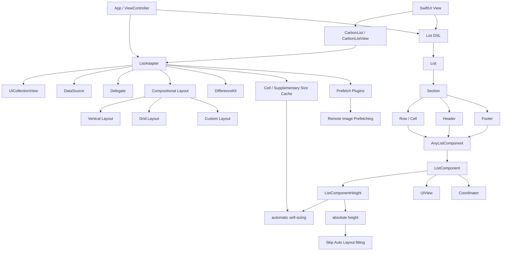
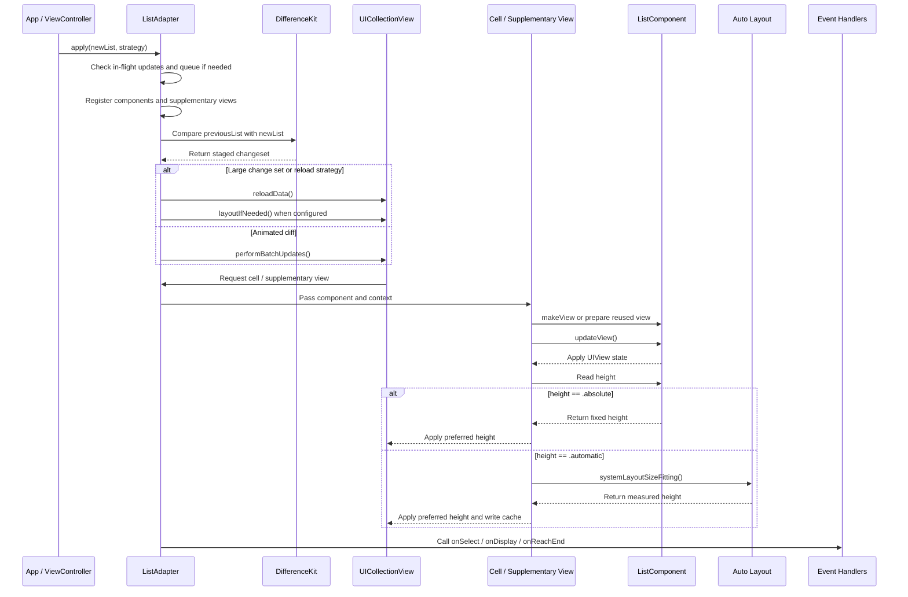

# CarbonListKit

[한국어](README.md) | English

CarbonListKit is a UIKit list adapter for building `UICollectionView` screens from declarative lists, sections, rows, and components.

It removes repeated collection view boilerplate from view controllers:

- cell registration
- data source and delegate plumbing
- component rendering
- Auto Layout based sizing
- row selection and display events
- DifferenceKit based diff updates
- compositional layout setup
- list reach-end events

The current implementation covers the core list adapter, SwiftUI bridge, SwiftUI component bridge, supplementary header/footer support, prefetching, orthogonal sections, and the example app. Refresh control wrappers and DocC documentation are planned next.

## Requirements

| Item | Value |
| --- | --- |
| Platform | iOS 13+ |
| Language | Swift 5.9+ |
| UI framework | UIKit, SwiftUI bridge |
| Package manager | Swift Package Manager |
| Diff engine | DifferenceKit |

## Installation

Add CarbonListKit as a Swift Package dependency.

```swift
.package(url: "https://github.com/indextrown/CarbonListKit", branch: "1.0.0")
```

For local development, the example app uses a local package reference:

```text
Example/CarbonListKitExample.xcodeproj
  -> local package ../
  -> product CarbonListKit
```

## Quick Start

```swift
import CarbonListKit
import UIKit

final class FeedViewController: UIViewController {
  private let collectionView = UICollectionView(
    frame: .zero,
    collectionViewLayout: UICollectionViewLayout()
  )

  private lazy var adapter = ListAdapter(collectionView: collectionView)

  override func viewDidLoad() {
    super.viewDidLoad()

    view.addSubview(collectionView)
    collectionView.translatesAutoresizingMaskIntoConstraints = false
    NSLayoutConstraint.activate([
      collectionView.topAnchor.constraint(equalTo: view.topAnchor),
      collectionView.leadingAnchor.constraint(equalTo: view.leadingAnchor),
      collectionView.trailingAnchor.constraint(equalTo: view.trailingAnchor),
      collectionView.bottomAnchor.constraint(equalTo: view.bottomAnchor)
    ])

    render()
  }

  private func render() {
    adapter.apply(updateStrategy: .animated) {
      Section(id: "posts") {
        Row(
          id: "post-1",
          component: PostComponent(
            viewModel: .init(
              title: "Hello CarbonListKit",
              subtitle: "A UIKit row rendered from a component."
            )
          )
        )
        .onSelect { context in
          print("selected", context.indexPath)
        }
      }
      .layout(.vertical(spacing: 12))
      .contentInsets(.init(top: 16, leading: 0, bottom: 16, trailing: 0))
    }
  }
}
```

### SwiftUI Usage

`CarbonList` wraps the existing `ListAdapter` for SwiftUI. Rendering, diff updates, and layout are still handled by the UIKit adapter.

```swift
import CarbonListKit
import SwiftUI

struct FeedScreen: View {
  let posts: [Post]

  var body: some View {
    CarbonList(updateStrategy: .animated, backgroundColor: .systemGroupedBackground) {
      Section(id: "posts") {
        for post in posts {
          Row(
            id: post.id,
            component: PostComponent(viewModel: .init(post: post))
          )
        }
      }
      .layout(.vertical(spacing: 10))
      .contentInsets(.init(top: 16, leading: 0, bottom: 16, trailing: 0))
    }
  }
}
```

### Using a Component Directly in SwiftUI

If a component conforms to `SwiftUIComponent`, the same type can be used directly as a SwiftUI `View`.

```swift
struct SampleComponent: SwiftUIComponent {
  struct ViewModel: Equatable {
    let title: String
  }

  let viewModel: ViewModel

  func makeSwiftUIView() -> some View {
    Text(viewModel.title)
      .font(.headline)
  }

  func makeView(context: ListComponentContext<Void>) -> SampleUIKitView {
    SampleUIKitView()
  }

  func updateView(_ view: SampleUIKitView, context: ListComponentContext<Void>) {
    view.configure(title: viewModel.title)
  }
}
```

Now the same component can be used directly in a SwiftUI screen as `SampleComponent(viewModel: ...)`, while still being reused inside CarbonListKit's UIKit list rendering.

## Core Concepts

### ListAdapter

`ListAdapter` owns the collection view data source and delegate.

```swift
private lazy var adapter = ListAdapter(
  collectionView: collectionView,
  configuration: .init(batchUpdateInterruptCount: 200)
)
```

Do not set `collectionView.dataSource` or `collectionView.delegate` directly after creating the adapter.

Use `snapshot()` when you need the currently applied list state.

```swift
let currentList = adapter.snapshot()
```

`batchUpdateInterruptCount` is a safety switch that falls back to `reloadData` when one animated diff contains too many changes.

### List

`List` is the full snapshot of the collection view.

```swift
let list = List {
  Section(id: "main") {
    Row(id: "row", component: MyComponent(viewModel: model))
  }
}

adapter.apply(list)
```

You can also use the builder overload:

```swift
adapter.apply {
  Section(id: "main") {
    Row(id: "row", component: MyComponent(viewModel: model))
  }
}
```

### Section

`Section` groups rows and owns section-level layout, insets, spacing, and supplementary header/footer views.

```swift
Section(id: "articles") {
  for article in articles {
    Row(
      id: article.id,
      component: ArticleRowComponent(
        viewModel: .init(article: article)
      )
    )
  }
}
.layout(.vertical(spacing: 10))
.contentInsets(.init(top: 16, leading: 0, bottom: 16, trailing: 0))
```

`contentInsets` applies to the row content area. Header and footer supplementary views keep the full section width.

Compatibility-style modifiers are also available:

```swift
Section(id: "articles") {
  // rows
}
.withSectionLayout(.vertical(spacing: 10))
.withSectionContentInsets(.init(top: 16, leading: 0, bottom: 16, trailing: 0))
```

Use `sectionInsets` when you want header, footer, and rows to move together.

```swift
Section(id: "articles") {
  // rows
}
.sectionInsets(.init(top: 0, leading: 16, bottom: 0, trailing: 16))
```

Use `sectionSpacing` for the distance between the current section and the next section.

```swift
Section(id: "first") {
  Row(id: "row", component: RowComponent(viewModel: model))
}
.sectionSpacing(24)

Section(id: "second") {
  Row(id: "row", component: RowComponent(viewModel: model))
}
```

`sectionSpacing` is not applied to the last section. If the last section needs bottom padding, use `contentInsets.bottom` or `sectionInsets.bottom`.

Inset modifiers have different meanings:

| Modifier | Applies to | Use when |
| --- | --- | --- |
| `.contentInsets(...)` | row content area | Keep header/footer full-width and inset only rows |
| `.sectionInsets(...)` | header/footer + rows | Inset the whole section together, like a card |
| `.sectionSpacing(...)` | between the current section and the next section | Add section-to-section spacing |

### Orthogonal Sections

Orthogonal sections scroll horizontally while the overall list remains vertical. You can omit most parameters thanks to defaults.

```swift
Section(id: "carousel") {
  for item in items {
    Row(id: item.id, component: CardComponent(viewModel: .init(item: item)))
  }
}
.layout(.orthogonal(itemSpacing: 12, lineSpacing: 12, scrollingBehavior: .continuous, reservedHeight: 180))
```

`reservedHeight` pre-allocates space for content that may grow taller, so the section and any following content stay stable even before the longest item appears.

### Header and Footer

`Header` and `Footer` are real collection view supplementary views, not rows. They use the same `ListComponent` protocol as row components.

```swift
Section(id: "profile") {
  Row(id: "name", component: ProfileRowComponent(viewModel: name))
  Row(id: "email", component: ProfileRowComponent(viewModel: email))
} header: {
  Header(
    id: "profile-header",
    component: TitleComponent(viewModel: .init(title: "Profile"))
  )
} footer: {
  Footer(
    id: "profile-footer",
    component: CaptionComponent(viewModel: .init(text: "You can change account details anytime."))
  )
}
.layout(.vertical(spacing: 10))
```

The initializer style is still supported:

```swift
Section(
  id: "profile",
  header: Header(id: "profile-header", component: TitleComponent(viewModel: title)),
  footer: Footer(id: "profile-footer", component: CaptionComponent(viewModel: caption))
) {
  Row(id: "name", component: ProfileRowComponent(viewModel: name))
}
```

Specify `layoutSize` when a header or footer needs a custom estimated or fixed height.

```swift
Footer(
  id: "loading-footer",
  component: LoadingComponent(viewModel: .init(title: "Loading more")),
  layoutSize: .estimated(height: 72)
)
```

### Row

`Row` represents one collection view item.

```swift
Row(id: article.id, component: ArticleRowComponent(viewModel: .init(article: article)))
  .onSelect { context in
    print(context.rowID)
  }
  .onDisplay { context in
    print("displayed", context.indexPath)
  }
  .onEndDisplay { context in
    print("ended", context.indexPath)
  }
```

`Cell` is currently a typealias for `Row` for users who prefer cell-oriented naming:

```swift
Cell(id: "summary", component: SummaryComponent(viewModel: summary))
  .didSelect { context in
    print(context.indexPath)
  }
  .willDisplay { context in
    print(context.indexPath)
  }
```

## Components

Components turn app data into UIKit views. They are similar in spirit to `UIViewRepresentable`.

```swift
struct PostComponent: ListComponent {
  struct ViewModel: Equatable {
    let title: String
    let subtitle: String
  }

  let viewModel: ViewModel

  func makeView(context: ListComponentContext<Void>) -> PostView {
    PostView()
  }

  func updateView(_ view: PostView, context: ListComponentContext<Void>) {
    view.configure(
      title: viewModel.title,
      subtitle: viewModel.subtitle
    )
  }
}
```

When `ViewModel` is `Equatable`, CarbonListKit can detect content changes for rows that keep the same identity.

The default component layout pins the view to the cell content view edges with Auto Layout.

You can override it:

```swift
func layoutView(_ view: PostView, in container: UIView) {
  view.translatesAutoresizingMaskIntoConstraints = false
  container.addSubview(view)
  NSLayoutConstraint.activate([
    view.topAnchor.constraint(equalTo: container.topAnchor, constant: 8),
    view.leadingAnchor.constraint(equalTo: container.leadingAnchor, constant: 16),
    view.trailingAnchor.constraint(equalTo: container.trailingAnchor, constant: -16),
    view.bottomAnchor.constraint(equalTo: container.bottomAnchor, constant: -8)
  ])
}
```

Use a coordinator when a component needs an owned state object. The default coordinator is `Void`.

```swift
struct TimerComponent: ListComponent {
  struct ViewModel: Equatable {
    let title: String
  }

  final class Coordinator {
    var tickCount = 0
  }

  let viewModel: ViewModel

  func makeCoordinator() -> Coordinator {
    Coordinator()
  }

  func makeView(context: ListComponentContext<Coordinator>) -> TimerView {
    TimerView()
  }

  func updateView(_ view: TimerView, context: ListComponentContext<Coordinator>) {
    context.coordinator.tickCount += 1
    view.configure(title: viewModel.title, tickCount: context.coordinator.tickCount)
  }
}
```

Cell reuse identifiers default to the component type name. Override `reuseIdentifier` when one component type needs multiple cell registrations.

```swift
var reuseIdentifier: String {
  "ArticleRowComponent.compact"
}
```

If a row has a known height, implement `height` on the component. If you do not implement it, the default is `.automatic` and CarbonListKit keeps using Auto Layout self-sizing.

```swift
struct FixedArticleComponent: ListComponent {
  struct ViewModel: Equatable {
    let title: String
  }

  let viewModel: ViewModel

  var height: ListComponentHeight {
    .absolute(72)
  }

  func makeView(context: ListComponentContext<Void>) -> ArticleRowView {
    ArticleRowView()
  }

  func updateView(_ view: ArticleRowView, context: ListComponentContext<Void>) {
    view.configure(title: viewModel.title)
  }
}
```

When a component returns `.absolute`, `ComponentCell` skips `systemLayoutSizeFitting` and applies that height directly. Make sure the component view is designed for the fixed height, otherwise its content may be compressed.

## Entity vs Component ViewModel

App entities should stay separate from component view models.

```swift
struct Article: Identifiable, Equatable {
  let id: String
  let title: String
  let author: String
  let readTimeMinutes: Int
  let isRead: Bool
}
```

`Article` is app/domain data. The component `ViewModel` is the render-ready shape for one UIKit view.

```swift
struct ArticleRowComponent: ListComponent {
  struct ViewModel: Equatable {
    let title: String
    let metadata: String
    let readStateTitle: String
    let readStateColor: UIColor

    init(article: Article) {
      self.title = article.title
      self.metadata = "\(article.author) · \(article.readTimeMinutes) min read"
      self.readStateTitle = article.isRead ? "Read" : "Unread"
      self.readStateColor = article.isRead ? .systemGray : .systemGreen
    }
  }

  let viewModel: ViewModel

  func makeView(context: ListComponentContext<Void>) -> ArticleRowView {
    ArticleRowView()
  }

  func updateView(_ view: ArticleRowView, context: ListComponentContext<Void>) {
    view.configure(
      title: viewModel.title,
      metadata: viewModel.metadata,
      readStateTitle: viewModel.readStateTitle,
      readStateColor: viewModel.readStateColor
    )
  }
}
```

## Layout

CarbonListKit currently supports vertical, grid, and custom compositional layouts.

### Vertical

```swift
Section(id: "feed") {
  // rows
}
.layout(.vertical(spacing: 12))
```

### Grid

```swift
Section(id: "metrics") {
  Row(id: "one", component: MetricComponent(viewModel: one))
  Row(id: "two", component: MetricComponent(viewModel: two))
}
.layout(.grid(columns: 2, itemSpacing: 10, lineSpacing: 10))
.contentInsets(.init(top: 0, leading: 16, bottom: 16, trailing: 16))
```

In grid layouts, `itemSpacing` controls only the horizontal space between items. Outer section padding should be expressed with `contentInsets` or `sectionInsets`.

### Custom

```swift
Section(id: "custom") {
  Row(id: "custom-row", component: CustomComponent(viewModel: model))
}
.layout(.custom { context in
  print(context.section.id, context.sectionIndex, context.environment.container.effectiveContentSize)

  let itemSize = NSCollectionLayoutSize(
    widthDimension: .fractionalWidth(1),
    heightDimension: .estimated(44)
  )
  let item = NSCollectionLayoutItem(layoutSize: itemSize)
  let group = NSCollectionLayoutGroup.vertical(layoutSize: itemSize, subitems: [item])
  let section = NSCollectionLayoutSection(group: group)
  section.interGroupSpacing = 12
  return section
})
```

## Updating

CarbonListKit uses DifferenceKit to apply section and row changes.

```swift
adapter.apply(list, updateStrategy: .animated)
```

The builder overload also supports completion.

```swift
adapter.apply(updateStrategy: .nonAnimated) {
  Section(id: "articles") {
    for article in articles {
      Row(id: article.id, component: ArticleRowComponent(viewModel: .init(article: article)))
    }
  }
} completion: {
  print("applied")
}
```

Supported strategies:

```swift
public enum UpdateStrategy {
  case animated
  case nonAnimated
  case reloadData
}
```

### Identity and Equality

Diff identity:

- section identity: `Section.id`
- row identity: `Row.id`

Content equality:

- row content equality uses `AnyListComponent`
- component equality uses component type plus component view model

This means a row can keep the same identity while its component content changes.

```swift
articles = articles.map { article in
  article.id == selectedID ? article.togglingRead() : article
}

adapter.apply(updateStrategy: .animated) {
  Section(id: "articles") {
    for article in articles {
      Row(
        id: article.id,
        component: ArticleRowComponent(viewModel: .init(article: article))
      )
    }
  }
}
```

### Update Queue

If `apply` is called while another update is running, CarbonListKit keeps the latest requested update and applies it after the current update finishes.

The current policy is last-write-wins.

## Events

Row event modifiers:

```swift
Row(id: "row", component: Component(viewModel: model))
  .onSelect { context in
    print(context.indexPath)
  }
  .onDisplay { context in
    print(context.contentView as Any)
  }
  .onEndDisplay { context in
    print(context.rowID)
  }
```

Compatibility names:

```swift
Cell(id: "row", component: Component(viewModel: model))
  .didSelect { context in
    print(context.indexPath)
  }
  .willDisplay { context in
    print(context.indexPath)
  }
```

`RowEventContext` contains:

- `indexPath`
- `rowID`
- `component`
- `collectionView`
- `cell`
- `contentView`

List-level reach-end events are also available. Use them for infinite scrolling or next-page loading.

`onReachEnd` is a `List` modifier. Pass `List { ... }.onReachEnd(...)` to `adapter.apply(_:)` instead of placing it inside the builder overload.

```swift
adapter.apply(
  List {
    Section(id: "feed") {
      for item in items {
        Row(id: item.id, component: FeedItemComponent(viewModel: .init(item: item)))
      }
    }
    .layout(.vertical(spacing: 10))
  }
  .onReachEnd(offsetFromEnd: .relativeToContainerSize(multiplier: 1.0)) { context in
    loadNextPage()
  }
)
```

Supported offsets:

- `.relativeToContainerSize(multiplier:)`: computes the threshold from the collection view length
- `.absolute(_:)`: uses a fixed point distance

`onReachEnd` fires while scrolling when the remaining distance is less than or equal to the offset. For horizontal layouts it uses width/contentSize.width, and otherwise it uses height/contentSize.height.

For page loading, keep a loading flag near your data source. `onReachEnd` can be called more than once while the user stays near the end.

```swift
private var isLoadingNextPage = false

private func loadNextPageIfNeeded() {
  guard isLoadingNextPage == false else {
    return
  }

  isLoadingNextPage = true
  api.fetchNextPage { [weak self] newItems in
    guard let self else {
      return
    }

    self.items.append(contentsOf: newItems)
    self.isLoadingNextPage = false
    self.render()
  }
}
```

Use `ReachEndContext` when the handler needs access to the collection view.

```swift
.onReachEnd(offsetFromEnd: .absolute(240)) { context in
  print(context.collectionView?.contentOffset as Any)
}
```

## Example App

The repository includes a SwiftUI based example app:

```text
Example/
  CarbonListKitExample.xcodeproj
  CarbonListKitExample/
    App/
    Examples/
```

The SwiftUI app hosts UIKit view controllers through `UIViewControllerRepresentable`.

Examples:

- `Diff updates`: add, shuffle, and update rows
- `Entity to ViewModel`: maps domain entities into component view models and shows available modifiers/layouts
- `Infinite Scroll`: appends the next page when the list reaches the end
- `Prefetch`: prefetches images through collection view prefetching and stores them in cache
- `Header & Footer`: demonstrates real supplementary header/footer views, section spacing, and grid usage
- `Header & Footer DSL`: demonstrates `Section { rows } header: { ... } footer: { ... }` and inset modifier differences
- `Component Height`: compares `.automatic` self-sizing rows with component-defined `.absolute` row heights
- `SwiftUI CarbonList`: demonstrates the `CarbonList { Section { Row } }` DSL directly in a SwiftUI screen
- `한글 종합 예제`: shows diffing, ViewModel mapping, events, layouts, and infinite scrolling in one screen

Build:

```bash
xcodebuild -project Example/CarbonListKitExample.xcodeproj \
  -scheme CarbonListKitExample \
  -sdk iphonesimulator \
  -derivedDataPath /tmp/CarbonListKitExampleDerivedData \
  build
```

## Current Feature Set

Implemented:

- Swift Package library target
- `ListAdapter`
- `ListAdapterConfiguration`
- SwiftUI bridge
  - `CarbonList`
  - `CarbonListView`
- SwiftUI component bridge
  - `SwiftUIComponent`
- `List`
- `Section`
- `Row`
- `Cell` typealias
- `ListComponent`
- `ListComponentHeight`
- `AnyListComponent`
- `ListComponentContext`
- result builders
  - `@ListBuilder`
  - `@RowsBuilder`
- automatic cell registration
- UIKit data source ownership
- UIKit delegate ownership
- Auto Layout based component rendering
- self-sizing collection view cells
- component-defined row heights
- component coordinators
- component reuseIdentifier override
- vertical layout
- grid layout
- custom layout
- custom layout context
- supplementary views
  - header
  - footer
- SwiftUI-style section header/footer DSL
- row selection event
- row display events
- list reach-end events
- DifferenceKit based diff updates
- update strategies
- apply completion
- snapshot access
- last-write-wins queued updates
- SwiftUI example app with UIKit controllers

## Modifier Summary

| Scope | Modifier | Description |
| --- | --- | --- |
| `Section` | `.layout(.vertical(spacing:))` | Applies a vertical list layout and sets the spacing between rows. |
| `Section` | `.layout(.grid(columns:itemSpacing:lineSpacing:))` | Applies a grid layout. `itemSpacing` is horizontal spacing between items, and `lineSpacing` is vertical spacing between rows. |
| `Section` | `.layout(.orthogonal(columns:itemSpacing:lineSpacing:scrollingBehavior:reservedHeight:))` | Applies a horizontally scrolling orthogonal section layout. |
| `Section` | `.layout(.custom { context in ... })` | Applies a custom `NSCollectionLayoutSection`. |
| `Section` | `.contentInsets(...)` | Applies insets only to the row content area while keeping header/footer full-width. |
| `Section` | `.sectionInsets(...)` | Applies insets to the whole section, including header/footer and rows. |
| `Section` | `.sectionSpacing(...)` | Sets the distance between the current section and the next section. It is not applied to the last section. |
| `Section` | `.header(...)`, `.footer(...)` | Sets header/footer with modifier-style APIs instead of initializer parameters. |
| `Section` | `.withSectionLayout(...)`, `.withSectionContentInsets(...)`, `.withSectionInsets(...)`, `.withSectionSpacing(...)` | Compatibility-style modifier names for users familiar with other list DSLs. |
| `Row` / `Cell` | `.onSelect(...)`, `.didSelect(...)` | Receives row selection events. |
| `Row` / `Cell` | `.onDisplay(...)`, `.willDisplay(...)` | Receives row display-start events. |
| `Row` | `.onEndDisplay(...)` | Receives row display-end events. |
| `List` | `.onReachEnd(offsetFromEnd:_:)` | Receives collection view reach-end events. |

Planned:

- refresh control wrapper
- DocC documentation

## Verification

Known working commands:

```bash
swift build
swift test
swift build --sdk /Applications/Xcode.app/Contents/Developer/Platforms/iPhoneSimulator.platform/Developer/SDKs/iPhoneSimulator26.4.sdk --triple arm64-apple-ios13.0-simulator
xcodebuild -project Example/CarbonListKitExample.xcodeproj -scheme CarbonListKitExample -sdk iphonesimulator -derivedDataPath /tmp/CarbonListKitExampleDerivedData build
```

## Inspiration

CarbonListKit takes inspiration from component-based list frameworks such as KarrotListKit, IGListKit, Airbnb Epoxy, and DifferenceKit.

## Performance Improvement History

| Area | Improvement | Expected effect |
| --- | --- | --- |
| Component registration | Iterates sections and rows directly during `apply` instead of flattening rows with `flatMap`. | Reduces unnecessary intermediate array allocations in large lists. |
| Layout after reload | `ListAdapterConfiguration.performsLayoutAfterReload` controls whether `layoutIfNeeded()` is forced after `reloadData`. | Can reduce immediate layout work during initial loads and large reloads. |
| Cell size cache | Caches self-sizing cell heights by `Row.id + component type + width`. Cached heights are reused only when the stored component equals the current component. | Reduces repeated Auto Layout measurement during scrolling. |
| Component absolute height | Skips `systemLayoutSizeFitting` when a component provides an `.absolute` height. | Removes Auto Layout measurement cost for rows whose height is already known and makes layout more predictable. |
| Supplementary size cache | Caches header/footer heights by `sectionID + supplementaryID + kind + component type + width + bottomSpacing`. | Reduces supplementary self-sizing work while safely distinguishing section spacing changes. |
| Prefetch management | Stores prefetch operations by `Row.id` instead of `IndexPath`, and cancels operations for rows removed by a list apply. | Keeps prefetch work more stable across diff updates and row moves. |
| Header/footer updates | Re-renders visible supplementary views when only header/footer content changes, instead of reloading the entire section. | Reduces row reload work for screens where headers or footers change frequently. |

## Overall Architecture



## Action Flow


