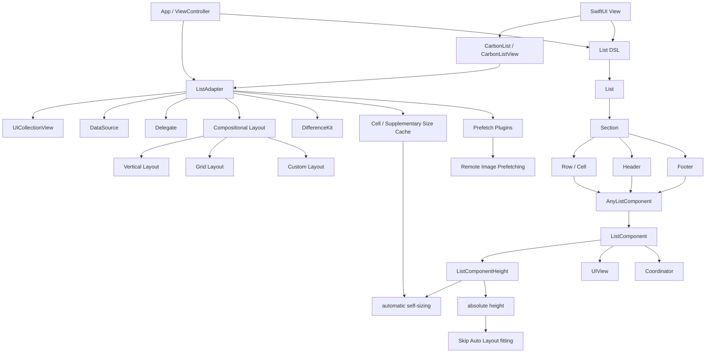
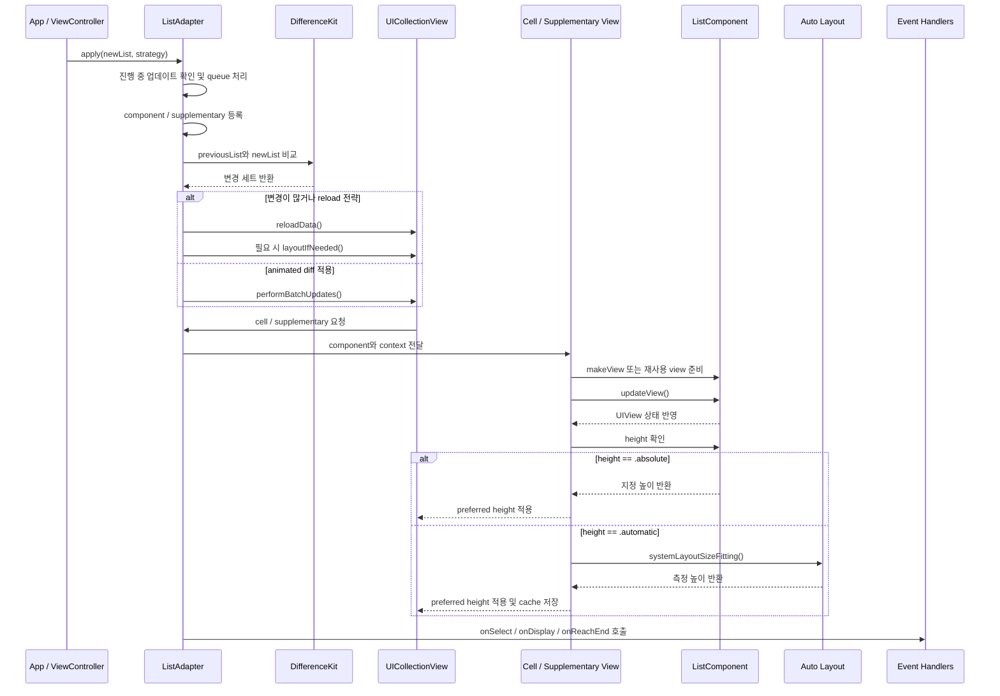

# CarbonListKit

[English](README.en.md) | 한국어

CarbonListKit은 선언형 `List`, `Section`, `Row`, `Component`로 `UICollectionView` 화면을 구성하는 UIKit 리스트 어댑터입니다.

반복되는 cell 등록, data source/delegate 연결, diff update, compositional layout 구성, selection/display 이벤트 처리를 ViewController 밖으로 밀어내고, 화면은 “현재 보여줄 목록 상태”만 선언하도록 돕습니다.

## 요구사항

| 항목 | 값 |
| --- | --- |
| Platform | iOS 13+ |
| Language | Swift 5.9+ |
| UI framework | UIKit, SwiftUI bridge |
| Package manager | Swift Package Manager |
| Diff engine | DifferenceKit |

## 설치

Swift Package dependency로 추가합니다.

```swift
.package(url: "https://github.com/indextrown/CarbonListKit", branch: "1.0.0")
```

로컬 개발에서는 예제 앱이 루트 패키지를 직접 참조합니다.

```text
Example/CarbonListKitExample.xcodeproj
  -> local package ../
  -> product CarbonListKit
```

## 빠른 시작

```swift
import CarbonListKit
import UIKit

final class FeedViewController: UIViewController {
  private let collectionView = UICollectionView(
    frame: .zero,
    collectionViewLayout: UICollectionViewLayout()
  )

  private lazy var adapter = ListAdapter(collectionView: collectionView)
  private var posts = Post.samplePosts

  override func viewDidLoad() {
    super.viewDidLoad()

    view.backgroundColor = .systemBackground
    collectionView.backgroundColor = .systemGroupedBackground
    collectionView.translatesAutoresizingMaskIntoConstraints = false
    view.addSubview(collectionView)

    NSLayoutConstraint.activate([
      collectionView.topAnchor.constraint(equalTo: view.topAnchor),
      collectionView.leadingAnchor.constraint(equalTo: view.leadingAnchor),
      collectionView.trailingAnchor.constraint(equalTo: view.trailingAnchor),
      collectionView.bottomAnchor.constraint(equalTo: view.bottomAnchor)
    ])

    render()
  }

  private func render() {
    adapter.apply(updateStrategy: .animated) {
      Section(id: "posts") {
        for post in posts {
          Row(
            id: post.id,
            component: PostComponent(viewModel: .init(post: post))
          )
          .onSelect { [weak self] _ in
            self?.toggleRead(postID: post.id)
          }
        }
      }
      .layout(.vertical(spacing: 10))
      .contentInsets(.init(top: 16, leading: 0, bottom: 16, trailing: 0))
    }
  }

  private func toggleRead(postID: Post.ID) {
    posts = posts.map { post in
      post.id == postID ? post.togglingRead() : post
    }
    render()
  }
}
```

Component는 UIKit view를 만들고 업데이트하는 작은 렌더링 단위입니다.

```swift
struct PostComponent: ListComponent {
  struct ViewModel: Equatable {
    let title: String
    let subtitle: String
    let readStateTitle: String
    let readStateColor: UIColor

    init(post: Post) {
      self.title = post.title
      self.subtitle = "\(post.author) · \(post.readTimeMinutes)분"
      self.readStateTitle = post.isRead ? "읽음" : "안 읽음"
      self.readStateColor = post.isRead ? .systemGray : .systemGreen
    }
  }

  let viewModel: ViewModel

  func makeView(context: ListComponentContext<Void>) -> PostRowView {
    PostRowView()
  }

  func updateView(_ view: PostRowView, context: ListComponentContext<Void>) {
    view.configure(
      title: viewModel.title,
      subtitle: viewModel.subtitle,
      readStateTitle: viewModel.readStateTitle,
      readStateColor: viewModel.readStateColor
    )
  }
}
```

### SwiftUI에서 사용

`CarbonList`는 기존 `ListAdapter`를 SwiftUI에서 사용할 수 있게 감싼 view입니다. 내부 렌더링, diff update, layout 처리는 UIKit 어댑터가 그대로 담당합니다.

```swift
import CarbonListKit
import SwiftUI

struct FeedScreen: View {
  let posts: [Post]

  var body: some View {
    CarbonList(updateStrategy: .animated, backgroundColor: .systemGroupedBackground) {
      Section(id: "posts") {
        for post in posts {
          Row(
            id: post.id,
            component: PostComponent(viewModel: .init(post: post))
          )
        }
      }
      .layout(.vertical(spacing: 10))
      .contentInsets(.init(top: 16, leading: 0, bottom: 16, trailing: 0))
    }
  }
}
```

### SwiftUIComponent로 컴포넌트 직접 쓰기

`SwiftUIComponent`를 채택하면 같은 컴포넌트를 SwiftUI `View`로도 바로 사용할 수 있습니다.

```swift
struct SampleComponent: SwiftUIComponent {
  struct ViewModel: Equatable {
    let title: String
  }

  let viewModel: ViewModel

  func makeSwiftUIView() -> some View {
    Text(viewModel.title)
      .font(.headline)
  }

  func makeView(context: ListComponentContext<Void>) -> SampleUIKitView {
    SampleUIKitView()
  }

  func updateView(_ view: SampleUIKitView, context: ListComponentContext<Void>) {
    view.configure(title: viewModel.title)
  }
}
```

이제 SwiftUI 화면에서는 `SampleComponent(viewModel: ...)`를 바로 `View`처럼 쓸 수 있고, CarbonListKit의 UIKit 리스트 안에서도 같은 컴포넌트를 재사용할 수 있습니다.

## 핵심 모델

| 타입 | 역할 | 주로 쓰는 API |
| --- | --- | --- |
| `ListAdapter` | `UICollectionView`의 data source, delegate, layout, update 적용을 담당합니다. | `apply`, `snapshot`, `configuration` |
| `CarbonList` | SwiftUI에서 같은 List DSL을 사용할 수 있게 `ListAdapter`를 감싼 view입니다. | `CarbonList { ... }` |
| `List` | collection view 전체 snapshot입니다. 여러 `Section`을 가집니다. | `List { ... }`, `onReachEnd` |
| `Section` | row 묶음과 section 단위 layout, inset, header/footer를 가집니다. | `layout`, `contentInsets`, `sectionInsets`, `sectionSpacing`, `header`, `footer` |
| `Row` | collection view item 하나입니다. id와 component, row 이벤트를 가집니다. | `onSelect`, `onDisplay`, `onEndDisplay` |
| `Cell` | `Row`와 같은 타입입니다. cell 중심 네이밍을 선호할 때 씁니다. | `didSelect`, `willDisplay` |
| `ListComponent` | 앱 데이터를 UIKit view로 렌더링합니다. | `makeView`, `updateView`, `layoutView`, `height`, `makeCoordinator` |
| `SwiftUIComponent` | 같은 컴포넌트를 SwiftUI `View`로도 직접 사용합니다. | `makeSwiftUIView`, `body` |
| `ListComponentHeight` | component가 row 높이를 자동 측정할지 직접 지정할지 표현합니다. | `.automatic`, `.absolute(...)` |
| `AnyListComponent` | 내부 type erasure wrapper입니다. diff equality, reuse identifier, height를 관리합니다. | `reuseIdentifier`, `height` |
| `ListComponentContext` | component의 coordinator를 view 생성/업데이트에 전달합니다. | `context.coordinator` |
| `ListLayout` | section별 compositional layout 방식을 표현합니다. | `.vertical`, `.grid`, `.orthogonal`, `.custom` |
| `Header` | 섹션 header supplementary view를 선언합니다. | `Header(id:component:layoutSize:)` |
| `Footer` | 섹션 footer supplementary view를 선언합니다. | `Footer(id:component:layoutSize:)` |

## 제공 기능

| 기능 | 설명 | 주요 API |
| --- | --- | --- |
| 선언형 목록 구성 | ViewController에서 collection view 상태를 `List`, `Section`, `Row`로 선언합니다. | `List {}`, `Section {}`, `Row(...)` |
| Result Builder | `if`, `for`, 배열 표현식을 사용해 section/row를 만들 수 있습니다. | `@ListBuilder`, `@RowsBuilder` |
| 자동 cell 등록 | component reuse identifier를 기준으로 필요한 cell을 자동 등록합니다. | `ListComponent.reuseIdentifier` |
| data source 소유 | adapter가 item 개수와 cell dequeue/render를 처리합니다. | `ListAdapter(collectionView:)` |
| delegate 소유 | selection, display, scroll 이벤트를 adapter가 받아 row/list 이벤트로 전달합니다. | `ListAdapter` |
| UIKit view component | 각 row는 일반 `UIView` 기반 component로 렌더링됩니다. | `ListComponent` |
| Auto Layout 렌더링 | 기본적으로 component view를 cell content view edge에 고정합니다. | `layoutView` |
| self-sizing cell | component view의 Auto Layout 크기를 collection view cell 크기에 반영합니다. | `ComponentCell` |
| component height | component가 row 높이를 직접 지정할 수 있습니다. 지정하지 않으면 self-sizing을 사용합니다. | `ListComponent.height`, `ListComponentHeight` |
| coordinator | component가 재사용되는 동안 유지할 상태 객체를 만들 수 있습니다. | `makeCoordinator`, `ListComponentContext` |
| reuse identifier override | 같은 component type을 여러 cell 종류로 나누어 등록할 수 있습니다. | `var reuseIdentifier` |
| diff update | DifferenceKit으로 section/row 삽입, 삭제, 이동, 업데이트를 적용합니다. | `adapter.apply(updateStrategy:)` |
| update strategy | animated, nonAnimated, reloadData 중 적용 방식을 선택합니다. | `UpdateStrategy` |
| apply completion | list 적용이 끝난 뒤 후처리를 실행합니다. | `completion` |
| update queue | 업데이트 중 다시 `apply`하면 마지막 요청을 보관했다가 이어서 적용합니다. | last-write-wins |
| snapshot 조회 | 현재 적용된 list 상태를 가져옵니다. | `adapter.snapshot()` |
| vertical layout | 세로 리스트 section을 만듭니다. | `.layout(.vertical(spacing:))` |
| grid layout | 지정한 열 수의 grid section을 만듭니다. | `.layout(.grid(columns:itemSpacing:lineSpacing:))` |
| custom layout | 직접 만든 `NSCollectionLayoutSection`을 section에 적용합니다. | `.layout(.custom { context in ... })` |
| layout context | custom layout에서 section, index, environment를 참조합니다. | `ListLayoutContext` |
| section header/footer | row가 아닌 실제 supplementary view로 header/footer를 렌더링합니다. | `Header`, `Footer` |
| SwiftUI 스타일 section DSL | rows를 먼저 쓰고 아래에 `header`/`footer` trailing closure를 붙일 수 있습니다. | `Section { ... } header: { ... } footer: { ... }` |
| SwiftUI bridge | SwiftUI 화면에서 같은 `List`, `Section`, `Row` DSL을 사용합니다. | `CarbonList`, `CarbonListView` |
| row 선택 이벤트 | 선택된 row의 id, indexPath, cell, contentView를 받습니다. | `onSelect`, `didSelect` |
| row 표시 이벤트 | cell 표시 시작 시점을 받습니다. | `onDisplay`, `willDisplay` |
| row 표시 종료 이벤트 | cell 표시 종료 시점을 받습니다. | `onEndDisplay` |
| reach-end 이벤트 | 끝 근처 도달 시 무한 스크롤/다음 페이지 로딩을 실행합니다. | `List.onReachEnd` |
| horizontal scroll 감지 | collection view scroll direction에 따라 reach-end 기준 축을 바꿉니다. | `ReachEndOffset` |
| prefetch 이벤트 | collection view가 아이템을 prefetch할 때 리소스를 미리 로드합니다. | `CollectionViewPrefetchingPlugin` |
| SwiftUI 예제 앱 | SwiftUI app entry에서 UIKit view controller 예제를 표시합니다. | `UIViewControllerRepresentable` |

## Modifier 요약

| 범위 | Modifier | 설명 |
| --- | --- | --- |
| `Section` | `.layout(.vertical(spacing:))` | 세로 목록 layout을 적용하고 row 사이 간격을 지정합니다. |
| `Section` | `.layout(.grid(columns:itemSpacing:lineSpacing:))` | grid layout을 적용합니다. `itemSpacing`은 item 사이 가로 간격, `lineSpacing`은 줄 사이 세로 간격입니다. |
| `Section` | `.layout(.orthogonal(columns:itemSpacing:lineSpacing:scrollingBehavior:reservedHeight:))` | 가로로 스크롤되는 orthogonal section layout을 적용합니다. |
| `Section` | `.layout(.custom { context in ... })` | 직접 만든 `NSCollectionLayoutSection`을 적용합니다. |
| `Section` | `.contentInsets(...)` | header/footer는 전체 폭으로 유지하고 row 영역에만 inset을 적용합니다. |
| `Section` | `.sectionInsets(...)` | header/footer와 row를 함께 감싸는 전체 section inset을 적용합니다. |
| `Section` | `.sectionSpacing(...)` | 현재 section과 다음 section 사이 간격을 지정합니다. 마지막 section에는 적용되지 않습니다. |
| `Section` | `.header(...)`, `.footer(...)` | initializer가 아닌 modifier 방식으로 header/footer를 설정합니다. |
| `Section` | `.withSectionLayout(...)`, `.withSectionContentInsets(...)`, `.withSectionInsets(...)`, `.withSectionSpacing(...)` | 다른 list DSL에 익숙한 naming을 위한 compatibility modifier입니다. |
| `Row` / `Cell` | `.onSelect(...)`, `.didSelect(...)` | row 선택 이벤트를 받습니다. |
| `Row` / `Cell` | `.onDisplay(...)`, `.willDisplay(...)` | row 표시 시작 이벤트를 받습니다. |
| `Row` | `.onEndDisplay(...)` | row 표시 종료 이벤트를 받습니다. |
| `List` | `.onReachEnd(offsetFromEnd:_:)` | collection view 끝 근처 도달 이벤트를 받습니다. |

## 아직 제공하지 않는 기능

| 기능 | 상태 |
| --- | --- |
| refresh control wrapper | 예정 |
| DocC 문서 | 예정 |

## 사용법

### 1. Adapter 만들기

`ListAdapter`는 collection view의 `dataSource`, `delegate`, `collectionViewLayout`을 설정합니다. adapter를 만든 뒤 같은 collection view의 `dataSource`나 `delegate`를 직접 덮어쓰지 마세요.

```swift
private lazy var adapter = ListAdapter(
  collectionView: collectionView,
  configuration: .init(batchUpdateInterruptCount: 200),
  prefetchingPlugins: [RemoteImagePrefetchingPlugin(remoteImagePrefetcher: myImagePrefetcher)]
)
```

`batchUpdateInterruptCount`보다 변경량이 크면 animated diff 대신 `reloadData`로 우회합니다.

### 2. List 적용하기

```swift
adapter.apply(updateStrategy: .animated) {
  Section(id: "main") {
    Row(id: "title", component: TitleComponent(viewModel: title))
    Row(id: "summary", component: SummaryComponent(viewModel: summary))
  }
}
```

`List`를 직접 만들어 전달할 수도 있습니다.

```swift
let list = List {
  Section(id: "main") {
    Row(id: "row", component: RowComponent(viewModel: model))
  }
}

adapter.apply(list, updateStrategy: .nonAnimated) {
  print("적용 완료")
}
```

### 3. Section layout 지정하기

세로 목록:

```swift
Section(id: "feed") {
  for item in items {
    Row(id: item.id, component: FeedComponent(viewModel: .init(item: item)))
  }
}
.layout(.vertical(spacing: 12))
.contentInsets(.init(top: 16, leading: 0, bottom: 16, trailing: 0))
```

2열 grid:

```swift
Section(id: "actions") {
  Cell(id: "add", component: ActionComponent(viewModel: add))
  Cell(id: "shuffle", component: ActionComponent(viewModel: shuffle))
}
.layout(.grid(columns: 2, itemSpacing: 10, lineSpacing: 10))
.contentInsets(.init(top: 0, leading: 16, bottom: 16, trailing: 16))
```

`grid`의 `itemSpacing`은 item 사이의 가로 간격만 담당합니다. 섹션 바깥 좌우 여백은 `contentInsets`나 `sectionInsets`로 명시합니다.

orthogonal section:

```swift
Section(id: "carousel") {
  for item in items {
    Row(id: item.id, component: CardComponent(viewModel: .init(item: item)))
  }
}
.layout(.orthogonal(itemSpacing: 12, lineSpacing: 12, scrollingBehavior: .continuous, reservedHeight: 180))
```

`orthogonal`은 가로로 스크롤되는 섹션입니다. 필요한 값만 적고 나머지는 기본값으로 둘 수 있습니다.
`reservedHeight`는 내용이 길어질 수 있는 경우 미리 확보할 높이를 지정합니다.

custom compositional layout:

```swift
Section(id: "custom") {
  Row(id: "note", component: NoteComponent(viewModel: note))
}
.layout(.custom { context in
  let itemSize = NSCollectionLayoutSize(
    widthDimension: .fractionalWidth(1),
    heightDimension: .estimated(44)
  )
  let item = NSCollectionLayoutItem(layoutSize: itemSize)
  let group = NSCollectionLayoutGroup.vertical(layoutSize: itemSize, subitems: [item])
  let section = NSCollectionLayoutSection(group: group)
  section.interGroupSpacing = CGFloat(8 + context.sectionIndex)
  return section
})
```

### 4. Header/Footer 사용하기

`Header`와 `Footer`는 `Row`가 아니라 collection view supplementary view로 렌더링됩니다. 같은 `ListComponent` 프로토콜을 사용하므로 row component와 동일한 방식으로 view를 만들고 업데이트합니다.

```swift
Section(id: "profile") {
  Row(id: "name", component: ProfileRowComponent(viewModel: name))
  Row(id: "email", component: ProfileRowComponent(viewModel: email))
} header: {
  Header(
    id: "profile-header",
    component: TitleComponent(viewModel: .init(title: "프로필"))
  )
} footer: {
  Footer(
    id: "profile-footer",
    component: CaptionComponent(viewModel: .init(text: "계정 정보는 언제든 변경할 수 있습니다."))
  )
}
.layout(.vertical(spacing: 10))
```

기존 initializer 스타일도 유지됩니다.

```swift
Section(
  id: "profile",
  header: Header(id: "profile-header", component: TitleComponent(viewModel: title)),
  footer: Footer(id: "profile-footer", component: CaptionComponent(viewModel: caption))
) {
  Row(id: "name", component: ProfileRowComponent(viewModel: name))
}
```

`layoutSize`를 지정하면 header/footer 높이를 조정할 수 있습니다.

```swift
Footer(
  id: "loading-footer",
  component: LoadingComponent(viewModel: .init(title: "더 불러오는 중")),
  layoutSize: .estimated(height: 72)
)
```

### 5. Section modifier 이해하기

섹션 여백 관련 modifier는 의도가 다릅니다.

| Modifier | 적용 대상 | 용도 |
| --- | --- | --- |
| `.contentInsets(...)` | row 영역 | header/footer는 전체 폭으로 유지하고 내부 row만 들여쓰기 |
| `.sectionInsets(...)` | header/footer + row 전체 | 섹션 전체를 카드처럼 함께 들여쓰기 |
| `.sectionSpacing(...)` | 현재 section과 다음 section 사이 | 섹션 간 간격 |

row만 들여쓰기:

```swift
Section {
  Row(id: "content-1", component: RowComponent(viewModel: first))
  Row(id: "content-2", component: RowComponent(viewModel: second))
} header: {
  Header(id: "header", component: HeaderComponent(viewModel: header))
} footer: {
  Footer(id: "footer", component: FooterComponent(viewModel: footer))
}
.contentInsets(.init(top: 0, leading: 16, bottom: 0, trailing: 16))
```

전체 섹션 들여쓰기:

```swift
Section {
  Row(id: "content", component: RowComponent(viewModel: content))
} header: {
  Header(id: "header", component: HeaderComponent(viewModel: header))
}
.sectionInsets(.init(top: 0, leading: 16, bottom: 0, trailing: 16))
```

섹션 사이 간격:

```swift
Section {
  Row(id: "first", component: RowComponent(viewModel: first))
}
.sectionSpacing(24)

Section {
  Row(id: "second", component: RowComponent(viewModel: second))
}
```

`sectionSpacing`은 마지막 섹션에는 적용되지 않습니다. 화면 마지막 하단 여백이 필요하면 마지막 섹션의 `contentInsets.bottom`이나 `sectionInsets.bottom`을 사용하세요.

### 6. Row 이벤트 받기

```swift
Row(id: post.id, component: PostComponent(viewModel: .init(post: post)))
  .onSelect { context in
    print(context.rowID, context.indexPath)
  }
  .onDisplay { context in
    print("display", context.contentView as Any)
  }
  .onEndDisplay { context in
    print("end", context.cell as Any)
  }
```

`Cell` alias를 사용할 때는 호환 naming도 쓸 수 있습니다.

```swift
Cell(id: "cell", component: CellComponent(viewModel: model))
  .didSelect { context in
    print(context.indexPath)
  }
  .willDisplay { context in
    print(context.rowID)
  }
```

`RowEventContext`가 제공하는 값:

| 값 | 설명 |
| --- | --- |
| `indexPath` | 이벤트가 발생한 item 위치 |
| `rowID` | 선언한 `Row.id` |
| `component` | 현재 row의 type-erased component |
| `collectionView` | 이벤트를 보낸 collection view |
| `cell` | 이벤트 대상 cell |
| `contentView` | component가 렌더링한 UIKit view |

### 7. 무한 스크롤 만들기

`onReachEnd`는 `List` modifier입니다. builder overload 안에서 바로 붙이는 대신 `List { ... }`를 만들고 `adapter.apply(_:)`로 전달합니다.

```swift
adapter.apply(
  List {
    Section(id: "feed") {
      for item in items {
        Row(id: item.id, component: FeedItemComponent(viewModel: .init(item: item)))
      }
    }
    .layout(.vertical(spacing: 10))
  }
  .onReachEnd(offsetFromEnd: .relativeToContainerSize(multiplier: 1.0)) { [weak self] _ in
    self?.loadNextPageIfNeeded()
  },
  updateStrategy: .animated
)
```

`onReachEnd`는 끝 근처에 머무르는 동안 여러 번 호출될 수 있으므로 loading flag를 두는 것이 좋습니다.

```swift
private var isLoadingNextPage = false

private func loadNextPageIfNeeded() {
  guard isLoadingNextPage == false else {
    return
  }

  isLoadingNextPage = true
  fetchNextPage { [weak self] newItems in
    guard let self else {
      return
    }

    self.items.append(contentsOf: newItems)
    self.isLoadingNextPage = false
    self.render()
  }
}
```

지원하는 offset:

| Offset | 설명 |
| --- | --- |
| `.relativeToContainerSize(multiplier:)` | collection view 길이에 multiplier를 곱한 거리 이내에서 호출 |
| `.absolute(_:)` | point 단위 고정 거리 이내에서 호출 |

## 업데이트 전략

| 전략 | 동작 | 사용하기 좋은 상황 |
| --- | --- | --- |
| `.animated` | DifferenceKit staged changeset을 `performBatchUpdates`로 적용합니다. | 일반적인 삽입, 삭제, 이동, 내용 변경 |
| `.nonAnimated` | 같은 diff 경로를 사용하지만 UIKit 애니메이션을 끄고 적용합니다. | 즉시 반영되어야 하는 필터/정렬 변경 |
| `.reloadData` | diff 없이 전체 collection view를 다시 로드합니다. | 변경량이 매우 크거나 상태를 강제로 리셋할 때 |

Diff 기준:

| 대상 | 기준 |
| --- | --- |
| Section identity | `Section.id` |
| Row identity | `Row.id` |
| Row content equality | component type + component view model equality |

같은 row identity를 유지한 채 component `ViewModel`만 바꾸면 “내용 업데이트”로 처리됩니다.

```swift
posts = posts.map { post in
  post.id == selectedID ? post.togglingRead() : post
}

render()
```

## Component 작성 가이드

앱/domain entity와 component `ViewModel`은 분리하는 것을 권장합니다.

```swift
struct Article: Identifiable, Equatable {
  let id: String
  let title: String
  let author: String
  let readTimeMinutes: Int
  let isRead: Bool
}
```

```swift
struct ArticleRowComponent: ListComponent {
  struct ViewModel: Equatable {
    let title: String
    let metadata: String
    let readStateTitle: String
    let readStateColor: UIColor

    init(article: Article) {
      self.title = article.title
      self.metadata = "\(article.author) · \(article.readTimeMinutes)분"
      self.readStateTitle = article.isRead ? "읽음" : "안 읽음"
      self.readStateColor = article.isRead ? .systemGray : .systemGreen
    }
  }

  let viewModel: ViewModel

  func makeView(context: ListComponentContext<Void>) -> ArticleRowView {
    ArticleRowView()
  }

  func updateView(_ view: ArticleRowView, context: ListComponentContext<Void>) {
    view.configure(
      title: viewModel.title,
      metadata: viewModel.metadata,
      readStateTitle: viewModel.readStateTitle,
      readStateColor: viewModel.readStateColor
    )
  }
}
```

기본 layout은 component view를 cell content view edge에 고정합니다. 여백이나 wrapper가 필요하면 `layoutView`를 override합니다.

```swift
func layoutView(_ view: ArticleRowView, in container: UIView) {
  view.translatesAutoresizingMaskIntoConstraints = false
  container.addSubview(view)
  NSLayoutConstraint.activate([
    view.topAnchor.constraint(equalTo: container.topAnchor, constant: 8),
    view.leadingAnchor.constraint(equalTo: container.leadingAnchor, constant: 16),
    view.trailingAnchor.constraint(equalTo: container.trailingAnchor, constant: -16),
    view.bottomAnchor.constraint(equalTo: container.bottomAnchor, constant: -8)
  ])
}
```

row 높이를 직접 알고 있다면 component에서 `height`를 구현합니다. 구현하지 않으면 기본값은 `.automatic`이고, 기존처럼 Auto Layout self-sizing으로 측정합니다.

```swift
struct FixedArticleComponent: ListComponent {
  struct ViewModel: Equatable {
    let title: String
  }

  let viewModel: ViewModel

  var height: ListComponentHeight {
    .absolute(72)
  }

  func makeView(context: ListComponentContext<Void>) -> ArticleRowView {
    ArticleRowView()
  }

  func updateView(_ view: ArticleRowView, context: ListComponentContext<Void>) {
    view.configure(title: viewModel.title)
  }
}
```

`.absolute`를 사용하면 `ComponentCell`이 `systemLayoutSizeFitting`을 건너뛰고 지정한 높이를 바로 사용합니다. 높이가 콘텐츠보다 작으면 내부 view가 압축될 수 있으므로, 고정 높이에 맞는 view 구성을 함께 설계해야 합니다.

component가 상태 객체를 가져야 한다면 coordinator를 사용합니다.

```swift
struct TimerComponent: ListComponent {
  struct ViewModel: Equatable {
    let title: String
  }

  final class Coordinator {
    var renderCount = 0
  }

  let viewModel: ViewModel

  func makeCoordinator() -> Coordinator {
    Coordinator()
  }

  func makeView(context: ListComponentContext<Coordinator>) -> TimerView {
    TimerView()
  }

  func updateView(_ view: TimerView, context: ListComponentContext<Coordinator>) {
    context.coordinator.renderCount += 1
    view.configure(title: viewModel.title, renderCount: context.coordinator.renderCount)
  }
}
```

prefetch가 필요한 컴포넌트는 `ComponentRemoteImagePrefetchable` 프로토콜을 준수합니다.

```swift
struct ImageComponent: ListComponent, ComponentRemoteImagePrefetchable {
  struct ViewModel: Equatable {
    let imageURL: URL
  }

  let viewModel: ViewModel

  var remoteImageURLs: [URL] {
    [viewModel.imageURL]
  }

  func makeView(context: ListComponentContext<Void>) -> ImageView {
    ImageView()
  }

  func updateView(_ view: ImageView, context: ListComponentContext<Void>) {
    view.loadImage(from: viewModel.imageURL)
  }
}
```

## 예제 앱

저장소에는 SwiftUI entry point에서 UIKit view controller를 표시하는 예제 앱이 포함되어 있습니다.

```text
Example/
  CarbonListKitExample.xcodeproj
  CarbonListKitExample/
    App/
    Examples/
```

| 예제 | 설명 |
| --- | --- |
| `Diff updates` | row 추가, 셔플, 내용 업데이트와 animated diff를 보여줍니다. |
| `Entity to ViewModel` | domain entity와 component ViewModel 분리, 업데이트 전략, layout modifier를 보여줍니다. |
| `Infinite Scroll` | `onReachEnd`로 다음 페이지를 append합니다. |
| `Prefetch` | collection view가 아이템을 prefetch할 때 이미지를 미리 로드하고 캐시에 저장합니다. prefetch된 이미지는 즉시 표시되어 부드러운 스크롤을 제공합니다. |
| `Header & Footer` | 실제 supplementary header/footer, section spacing, grid와 함께 쓰는 예제를 보여줍니다. |
| `Header & Footer DSL` | `Section { rows } header: { ... } footer: { ... }` 문법과 inset modifier 차이를 보여줍니다. |
| `Component Height` | `.automatic` self-sizing row와 component가 직접 지정한 `.absolute` row 높이를 비교합니다. |
| `SwiftUI CarbonList` | SwiftUI 화면에서 `CarbonList { Section { Row } }` DSL을 직접 쓰는 예제를 보여줍니다. |
| `한글 종합 예제` | diff, ViewModel, 이벤트, vertical/grid/custom layout, 무한 스크롤을 한 화면에서 확인합니다. |

빌드:

```bash
xcodebuild -project Example/CarbonListKitExample.xcodeproj \
  -scheme CarbonListKitExample \
  -sdk iphonesimulator \
  -derivedDataPath /tmp/CarbonListKitExampleDerivedData \
  build
```

## 검증

동작 확인에 사용할 수 있는 명령어:

```bash
swift build
swift test
swift build --sdk /Applications/Xcode.app/Contents/Developer/Platforms/iPhoneSimulator.platform/Developer/SDKs/iPhoneSimulator26.4.sdk --triple arm64-apple-ios13.0-simulator
xcodebuild -project Example/CarbonListKitExample.xcodeproj -scheme CarbonListKitExample -sdk iphonesimulator -derivedDataPath /tmp/CarbonListKitExampleDerivedData build
```

## Inspiration

CarbonListKit은 KarrotListKit, IGListKit, Airbnb Epoxy, DifferenceKit 같은 component 기반 리스트 프레임워크에서 영감을 받았습니다.

## 성능 개선 이력

| 항목 | 개선 내용 | 기대 효과 |
| --- | --- | --- |
| component 등록 | `apply` 때 row를 `flatMap`으로 펼치지 않고 section/row nested loop로 순회합니다. | 큰 리스트에서 불필요한 중간 배열 할당을 줄입니다. |
| reload 후 layout | `ListAdapterConfiguration.performsLayoutAfterReload`로 `reloadData` 이후 `layoutIfNeeded()` 강제 호출 여부를 제어합니다. | 초기 로드/대량 reload에서 즉시 레이아웃 계산 비용을 줄일 수 있습니다. |
| cell size cache | `Row.id + component type + width` 기준으로 self-sizing cell 높이를 캐시합니다. 저장된 component와 현재 component가 같을 때만 재사용합니다. | 스크롤 중 반복 Auto Layout 측정 비용을 줄입니다. |
| component absolute height | component가 `.absolute` 높이를 제공하면 `systemLayoutSizeFitting` 측정을 건너뜁니다. | 높이를 알고 있는 row에서 Auto Layout 측정 비용을 제거하고 layout 예측 가능성을 높입니다. |
| supplementary size cache | `sectionID + supplementaryID + kind + component type + width + bottomSpacing` 기준으로 header/footer 높이를 캐시합니다. | header/footer self-sizing 비용을 줄이고 section spacing 변화도 안전하게 구분합니다. |
| prefetch 관리 | prefetch 작업을 `IndexPath`가 아니라 `Row.id` 기준으로 저장하고, list 적용 시 사라진 row 작업을 cancel합니다. | diff update/row 이동 후에도 prefetch 작업이 더 안정적으로 관리됩니다. |
| header/footer 업데이트 | header/footer 내용만 바뀐 section은 section reload 대신 visible supplementary view만 re-render합니다. | row reload 범위를 줄이고 header/footer만 자주 바뀌는 화면에서 업데이트 비용을 낮춥니다. |

## 전체 아키텍처



## 액션 처리 흐름


